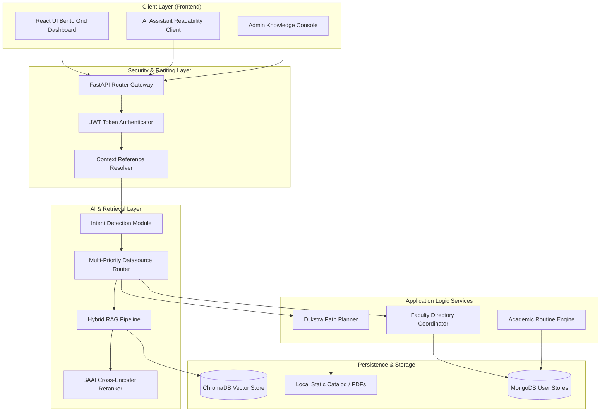
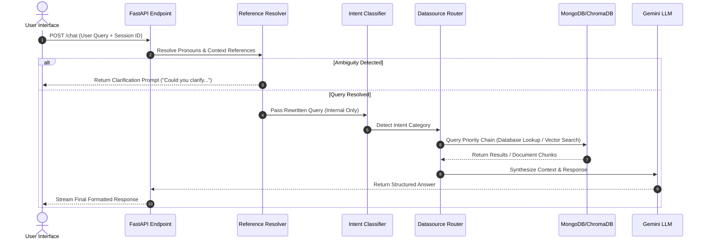
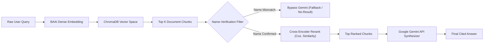
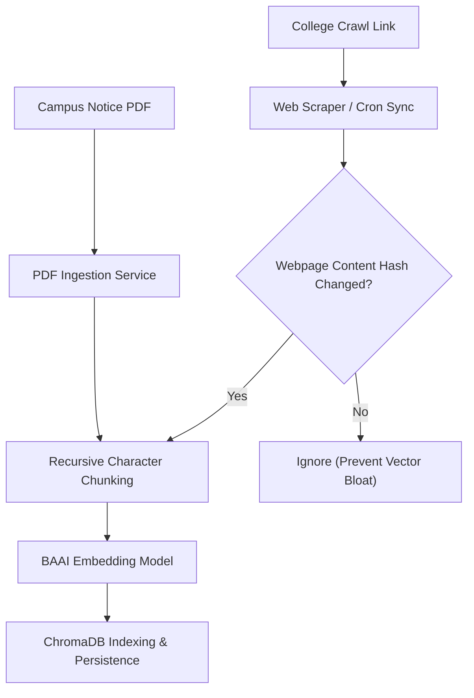
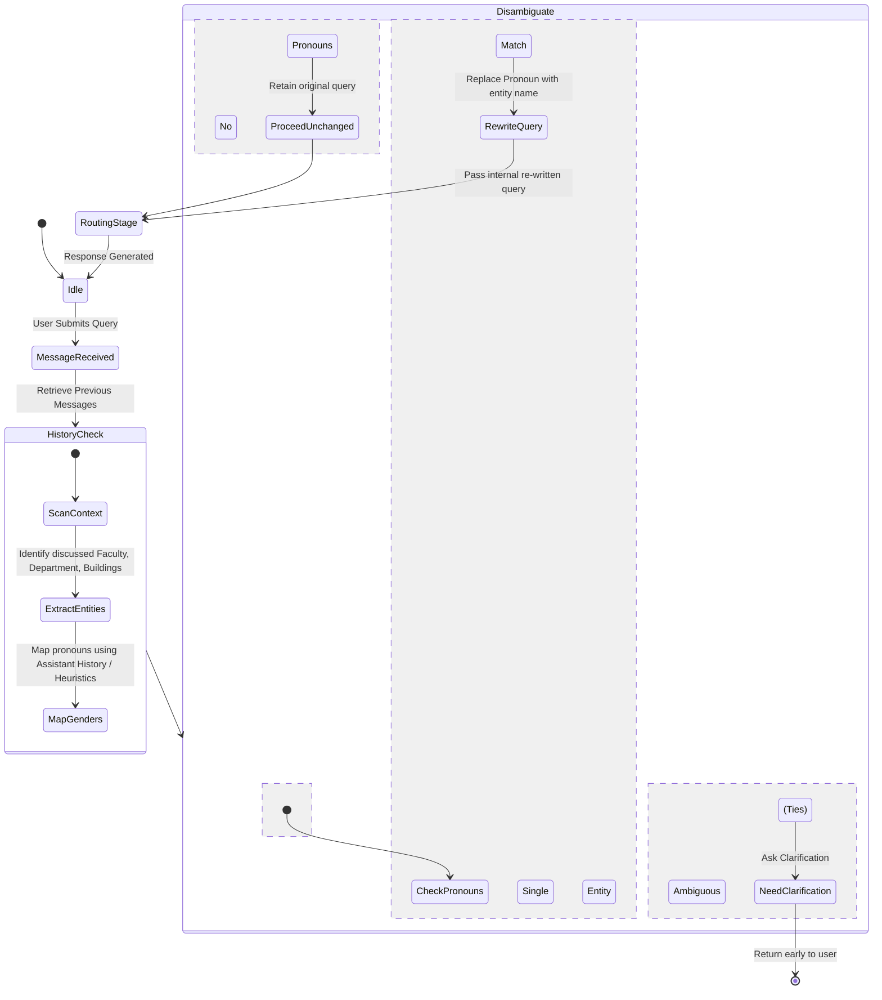
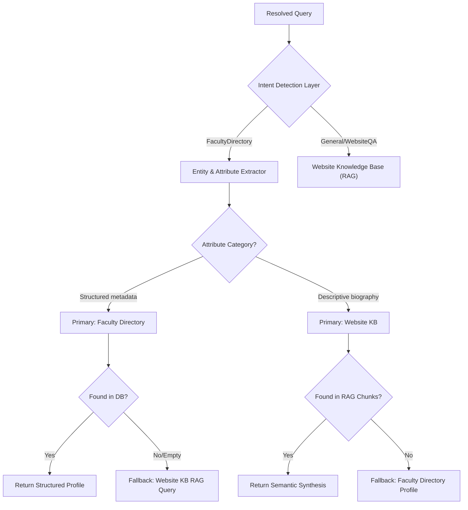

# BITATLAS — Campus Assistant & Student Workspace

<p align="center">
  
  
  
  
  
</p>

The **BITATLAS Campus Assistant & Student Workspace** is an enterprise-grade digital companion and personalized academic workspace custom-engineered for Birla Institute of Technology, Mesra. Designed for students, administrators, visitors, and evaluators, the platform integrates advanced NLP reference resolution, multi-priority query routing, hybrid retrieval-augmented generation (RAG), Dijkstra-based campus mapping, and automated academic schedule ingestion into a unified, high-performance portal.

---

## 📖 Table of Contents

- [Project Vision & Problem Statement](#-project-vision--problem-statement)
- [Key Objectives](#-key-objectives)
- [Core Features](#-core-features)
- [System Architecture](#-system-architecture)
  - [Overall Architecture](#overall-architecture)
  - [Request Processing Pipeline](#request-processing-pipeline)
  - [Hybrid RAG Pipeline](#hybrid-rag-pipeline)
  - [Knowledge Ingestion Pipeline](#knowledge-ingestion-pipeline)
  - [Conversation Flow](#conversation-flow)
  - [Intent Routing Flow](#intent-routing-flow)
- [Folder Directory Layout](#-folder-directory-layout)
- [Technology Stack](#-technology-stack)
- [Retrieval & Pipeline Mechanics](#-retrieval--pipeline-mechanics)
- [API Reference](#-api-reference)
- [Configuration & Environment Variables](#-configuration--environment-variables)
- [Installation & Local Setup](#-installation--local-setup)
- [Sample Queries & Responses](#-sample-queries--responses)
- [Automated QA & Testing Suite](#-automated-qa--testing-suite)
- [Future Roadmap](#-future-roadmap)
- [Contribution Guidelines](#-contribution-guidelines)
- [License](#-license)
- [Acknowledgements](#-acknowledgements)

---

## 🎯 Project Vision & Problem Statement

### The Problem
University campus ecosystems are highly fragmented. Critical information—such as academic calendars, building coordinates, exam timelines, administrative circulars, and faculty profiles—is typically scattered across unindexed PDF bulletins, dynamic deans' portals, local notice boards, and external websites. Students are forced to consult multiple outdated channels, leading to high information latency and friction in daily academic planning.

### The Solution
The **BITATLAS Workspace** consolidates these disjointed datasets into a cohesive, sub-10ms context-aware assistant. 
* **For Students**: Serves as an academic command center featuring smart routine imports, attendance bunk-calculators, walk-time mapping, and semantic notices searches.
* **For Administrators & Contributors**: Provides a secure admin control panel to crawl, hash, index, and manage document catalogs dynamically without service interruption.

---

## 🚀 Core Features

- **Academic Command Center**: Bento-grid style workspace displaying attendance trackers, schedules, customizable checklists, and calendar sync.
- **Context-Aware Reference Resolution**: Resolves complex pronoun references (e.g. *"her", "it", "they", "there"*) and implicit targets (e.g. *"Who is the HOD?"*) using deterministic context tracking.
- **Intelligent Intent & Datasource Routing**: Directs query intents (Faculty, Buildings, Notices, Timetables) dynamically to the fastest database lookup or semantic RAG engine.
- **Typo-Tolerant Faculty Resolution**: Fuzzy string matching handles misspelled names of all 340+ campus faculty members instantly.
- **Hybrid RAG Pipeline**: Combines dense vector searches (ChromaDB) with metadata filters, re-ranking retrieved chunks using a Cross-Encoder prior to Gemini LLM execution.
- **Gemini Ingestion Engine**: Scans routine sheets using Gemini Vision APIs to parse structural tables and automatically insert student schedules.
- **Dijkstra Campus Maps**: Real-time pathfinder calculating coordinate routes, walking walking steps, and ETAs between campus landmarks.
- **Telemetry & Diagnostics**: Collapsible runtime trace displays token metrics, cosine distance thresholds, reranking logs, and source document citations.

---

## 🏗 System Architecture

### Overall Architecture


### Request Processing Pipeline


### Hybrid RAG Pipeline


### Knowledge Ingestion Pipeline


### Conversation Flow


### Intent Routing Flow


---

## 📂 Folder Directory Layout

```text
bit-mesra-ai-agent/
├── backend/                        # FastAPI Application Modules
│   ├── app/
│   │   ├── auth/                   # JWT generation and validator policies
│   │   ├── context/                # Smart context assembly pipeline
│   │   ├── core/                   # Database connectors (ChromaDB, MongoDB)
│   │   ├── models/                 # Validation models (Pydantic v2 schemas)
│   │   ├── routes/                 # FastAPI routes (Auth, Academics, Chat, Admin)
│   │   ├── security/               # Middlewares (X-Request-ID, rate-limiting, audit logs)
│   │   └── services/               # Core domain business logic
│   │       ├── context_resolver/   # Conversational reference resolver
│   │       ├── faculty/            # Name resolver and typo fuzzy systems
│   │       ├── routing/            # Decision rules for datasource priorities
│   │       └── RAG/                # RAG querying, filtering, and cross-encoders
│   └── tests/                      # Unit, Integration, Routing, and Load tests
├── docs/                           # High-Level and Low-Level architecture blueprints
└── frontend/                       # React 18 SPA (Vite + TypeScript)
    ├── src/
    │   ├── app/                    # Global state hooks and theme context providers
    │   ├── features/               # Functional modules (Academics, Chat panel, Admin portal)
    │   └── shared/                 # Reusable components (Bento UI, Sidebar, Alerts)
```

---

## 💻 Technology Stack

### Frontend Stack
* **Core Framework**: React 18 (TypeScript)
* **Build System**: Vite (Fast HMR compilation)
* **Styling**: TailwindCSS (Modern, responsive grid layout)
* **State Management**: Zustand (Lightweight store modules)
* **Routing**: React Router DOM v6

### Backend Stack
* **Framework**: FastAPI (Asynchronous, non-blocking asynchronous event loop)
* **Language**: Python 3.13
* **Validation**: Pydantic v2 (Strict type checking)

### AI Stack
* **LLM Core**: Google Gemini 2.5 Flash
* **Dense Embeddings**: BAAI `bge-small-en-v1.5`
* **Reranker Model**: Cross-Encoder `ms-marco-MiniLM-L-6-v2`
* **Orchestration**: Custom lightweight RAG framework

### Database Stack
* **NoSQL Database**: MongoDB (Schedules, routine schemas, and session memory)
* **Vector Store**: ChromaDB (Notice files and scraped webpage indexes)

---

## 🤖 Retrieval & Pipeline Mechanics

### Context-Aware Reference Resolution
Interceptors decode pronouns (`he`, `she`, `it`, `they`, `them`) and implicit properties (`HOD`, `deadline`) prior to query processing.
- Uses message history on-the-fly.
- Differentiates gender boundaries from previous assistant responses to resolve singular pronouns.
- Identifies list outputs to bypass singular pronoun checks and allow list subset filters.
- Triggers disambiguation challenges when context matches multiple candidates.

### Hybrid RAG & Verification Filters
- Dense vector representations are searched against the ChromaDB vector index.
- Results pass through a strict **Name Verification Filter**. If the target faculty member's name is missing from the document snippets, the LLM call is bypassed. This prevents hallucinations and saves Gemini API quota.
- Survived chunks are re-ranked using Cross-Encoder cosine similarity. Chunks below a score threshold are dropped.

---

## 🌐 API Reference

| Endpoint | Method | Purpose | Auth Required |
| :--- | :--- | :--- | :--- |
| `/api/auth/register` | `POST` | Registers a new student account | No |
| `/api/auth/login` | `POST` | Authenticates user credentials, returns JWT | No |
| `/chat` | `POST` | Main AI chat endpoint using hybrid routing | Optional (Session-tracked) |
| `/api/academics/dashboard` | `GET` | Fetches routines, timetable, checklist, calendar | Yes |
| `/api/admin/documents/upload`| `POST` | Indexes local notice PDFs into ChromaDB | Yes (Admin) |
| `/api/admin/websites` | `POST` | Scrapes, checks hash changes, and indexes webpages | Yes (Admin) |

---

## ⚙ Configuration & Environment Variables

Create a `backend/.env` file in the backend root:

```env
# Database Settings
MONGODB_URI=mongodb://localhost:27017/bit_mesra_workspace
CHROMADB_PATH=./vector-db

# API Credentials
GEMINI_API_KEY=your_google_gemini_api_key

# JWT & Auth
JWT_SECRET=your_super_secret_jwt_sign_key
JWT_EXPIRATION_HOURS=24

# Environment
ENVIRONMENT=development
IS_DEV_MODE=true
```

---

## 🛠 Installation & Local Setup

### Prerequisites
* Python 3.13+
* Node.js 18+
* MongoDB running locally
* Gemini API Key

### Clone Repository
```bash
git clone https://github.com/Anugrahbhuinya/bit-mesra-ai-agent.git
cd bit-mesra-ai-agent
```

### Backend Installation
1. Navigate to backend directory:
   ```bash
   cd backend
   ```
2. Create and activate a Python virtual environment:
   ```bash
   python -m venv venv
   # On Windows:
   venv\Scripts\activate
   # On Unix:
   source venv/bin/activate
   ```
3. Install dependencies:
   ```bash
   pip install -r requirements.txt
   ```
4. Copy the environment template:
   ```bash
   cp .env.example .env
   ```
5. Launch the FastAPI server:
   ```bash
   uvicorn app.main:app --reload --port 8001
   ```

### Frontend Installation
1. Navigate to frontend directory:
   ```bash
   cd ../frontend
   ```
2. Install npm packages:
   ```bash
   npm install
   ```
3. Start the Vite dev server:
   ```bash
   npm run dev
   ```

---

## 💬 Sample Queries & Responses

### 1. Faculty Information & Smart Fallback
* **Query**: *"What are the academic qualifications of Dr. Vandana Bhattacharjee?"*
* **Response**: *"Dr. Vandana Bhattacharjee completed her PhD from Birla Institute of Technology, Mesra in 2009. She is a Senior Professor in the CSE Department specializing in Software Engineering."*
* **Pipeline Action**: Routes query to Website Knowledge Base RAG. If RAG details are empty, falls back to structured directory properties.

### 2. Context-Aware Reference Resolution
* **Query 1**: *"Tell me about Central Library."*
* **Query 2**: *"When does it close?"*
* **Response**: *"The Central Library closes at 9:00 PM on weekdays and 5:00 PM on weekends."*
* **Pipeline Action**: Rewrite engine replaces `"it"` with `"Central Library"`, sending the query `"When does Central Library close?"` to the intent classifier.

### 3. Faculty Name Ambiguity
* **Query 1**: *"Tell me about Dr. Mustafi."*
* **Query 2**: *"Tell me about Dr. Bhattacharjee."*
* **Query 3**: *"What are his publications?"*
* **Response**: *"Could you clarify which faculty member you mean?"*
* **Pipeline Action**: Recognizes multiple active male/female faculty entities in history. Bypasses execution to avoid guessing.

---

## 🧪 Automated QA & Testing Suite

We maintain a rigorous test harness verifying the stability of routing, extraction, resolution, and security logic:

- **Run reference resolution and rewriter checks**:
  ```bash
  cd backend
  python -m pytest test_routing_reference.py
  ```
- **Run routing priority rules checks**:
  ```bash
  python -m pytest test_routing.py
  ```
- **Run comprehensive chat integration tests**:
  ```bash
  python -m pytest test_faculty_assistant.py
  ```
- **Run REST endpoint tests**:
  ```bash
  python -m pytest test_faculty.py
  ```

---

## 🗺 Future Roadmap

- [ ] **Real-Time GPS Nav Integration**: Direct integration with campus mobile GPS endpoints for live walk navigation.
- [ ] **Unified Exam Seat Allocation Scraper**: Direct crawling of notice boards to display exam seating charts inside the student routine grids.
- [ ] **Hostel Fee Payment Integrations**: Integration of payment gateways inside the student billing cards.

---

## 🤝 Contribution Guidelines

We follow strict branching, linting, and PR review cycles.
1. Check [CONTRIBUTING.md](CONTRIBUTING.md) for style conventions.
2. Fork the repository, create a branch (`feature/your-feature`), and commit semantic messages.
3. Ensure the test suites (`pytest`) pass before opening a Pull Request.

---

## 📄 License

Distributed under the MIT License. See [LICENSE](LICENSE) for more details.

---

## 💖 Acknowledgements

* **Birla Institute of Technology, Mesra** for the campus dataset.
* The developers of **FastAPI**, **React**, **ChromaDB**, and **Sentence-Transformers**.
