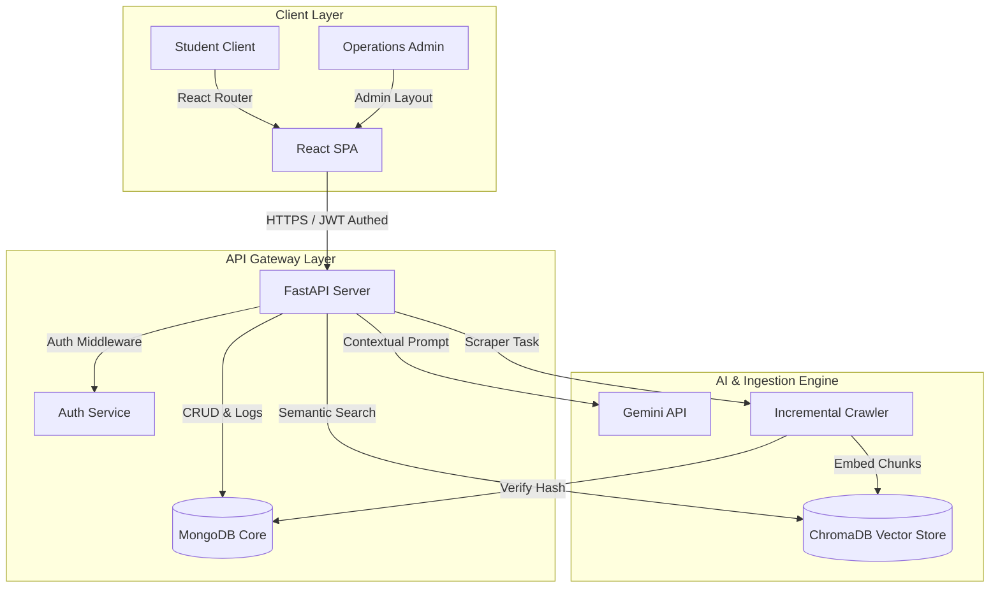
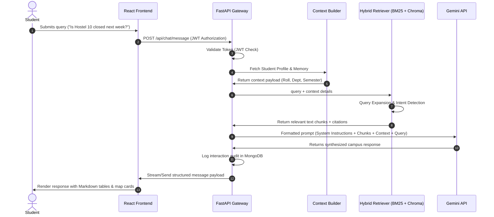
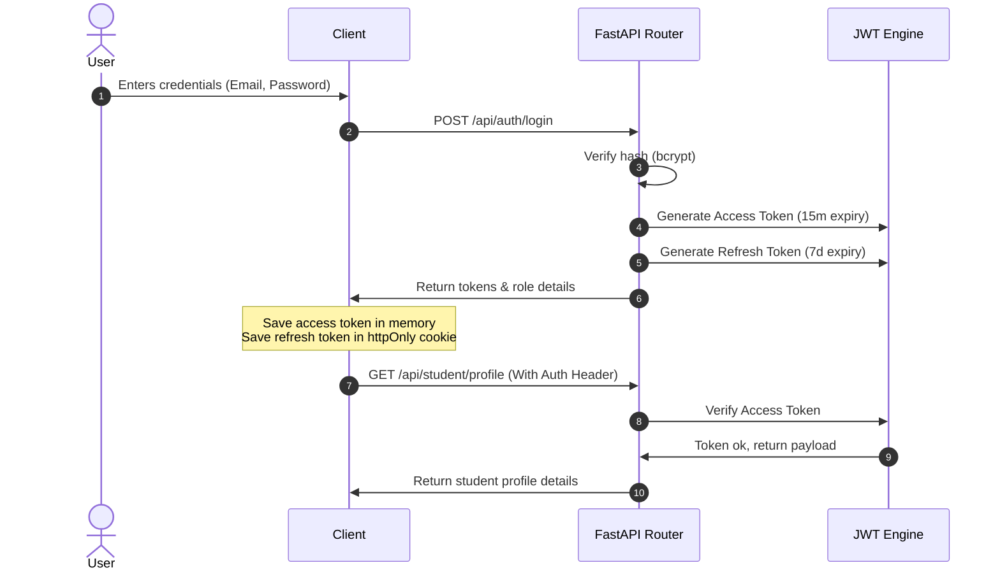
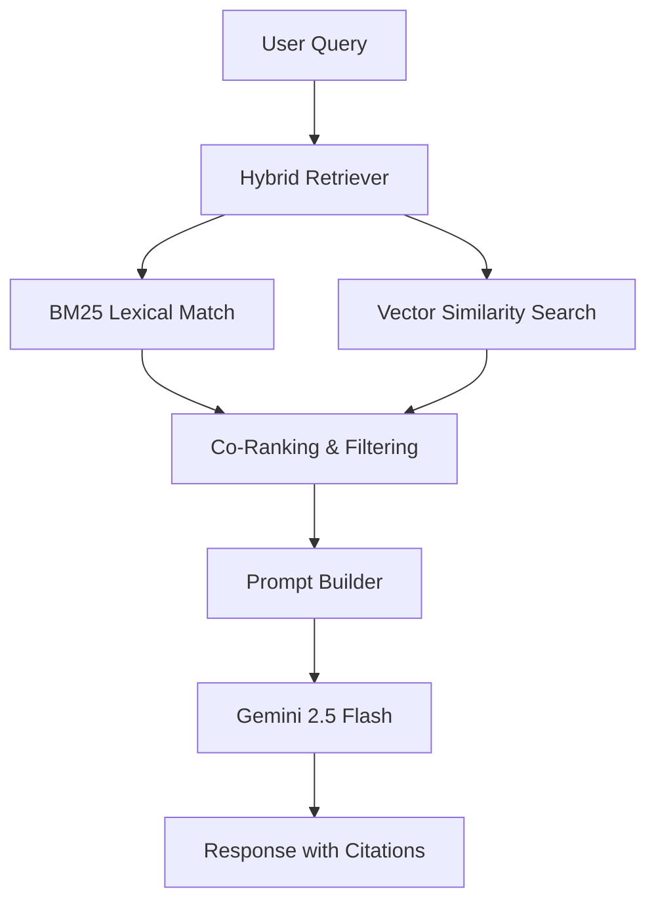
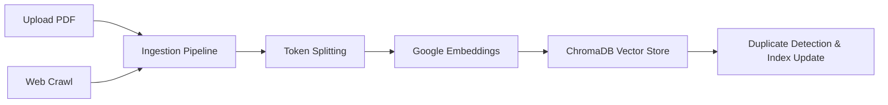
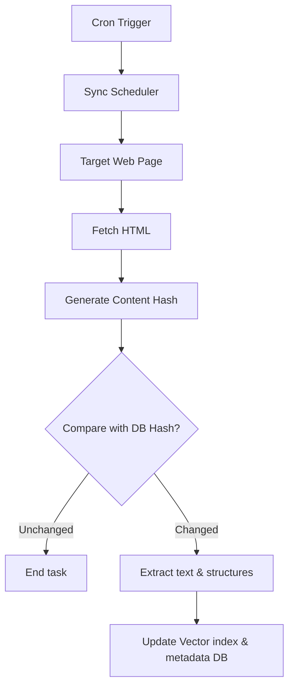

# BIT Mesra AI Workspace

An enterprise-grade, AI-powered digital campus platform and operational dashboard for the students and administrators of the Birla Institute of Technology, Mesra.

---

<p align="center">
  
  
  
  
</p>

<p align="center">
  
  
  
  
  
  
  
</p>

---

## 📋 Table of Contents

- [1. Hero Section](#1-hero-section)
- [2. Screen Layouts](#2-screen-layouts)
- [3. Feature Matrix](#3-feature-matrix)
- [4. High-Level Architecture (HLD)](#4-high-level-architecture-hld)
- [5. AI Request Flow](#5-ai-request-flow)
- [6. Backend Architecture](#6-backend-architecture)
- [7. Frontend Architecture](#7-frontend-architecture)
- [8. Repository Directory Tree](#8-repository-directory-tree)
- [9. Database Architecture](#9-database-architecture)
- [10. ChromaDB Vector Store](#10-chromadb-vector-store)
- [11. Authentication System](#11-authentication-system)
- [12. Personalized AI Context Engine](#12-personalized-ai-context-engine)
- [13. Hybrid RAG Pipeline](#13-hybrid-rag-pipeline)
- [14. Dynamic Knowledge Base](#14-dynamic-knowledge-base)
- [15. Website Synchronization Engine](#15-website-synchronization-engine)
- [16. Admin Operations Console](#16-admin-operations-console)
- [17. Student Portal Workspace](#17-student-portal-workspace)
- [18. Tech Stack Spec](#18-tech-stack-spec)
- [19. Installation Guide](#19-installation-guide)
- [20. Environment Configuration](#20-environment-configuration)
- [21. API Reference Guide](#21-api-reference-guide)
- [22. Development Guidelines](#22-development-guidelines)
- [23. Performance Optimizations](#23-performance-optimizations)
- [24. Security Standards](#24-security-standards)
- [25. Project Roadmap](#25-project-roadmap)
- [26. License](#26-license)

---

## 1. Hero Section

### 🌌 What is BIT Mesra AI Workspace?
BIT Mesra AI Workspace is an intelligent campus ecosystem designed to bridge the gap between complex university databases and student inquiries. It represents a unified workspace providing students with personalized, AI-driven summaries of notices, course schedules, academics metrics, and maps, while offering administrators a real-time operations console to manage documentation indexes and system logs.

### ⚠️ The Problem Statement
Universities process vast volumes of unstructured information daily: PDF semester notices, web announcements, class syllabi, academic compliance forms, and geographic markers. For students, searching this fragmented data pool creates friction. For administrators, maintaining synchronization between active web resources, document indexes, and LLM reference pools is operationally challenging.

### 💡 The Solution
A hybrid-retrieval, RAG-driven AI platform. Unstructured PDFs and official website pages are crawled, parsed, embedded, and indexed inside ChromaDB. An automated scheduler validates website checksums for incremental updates. Inquiries are processed via a context-aware semantic search pipeline that blends BM25 text match with vector similarity, compiling contextual prompts for Gemini to generate answers citing source documents.

---

## 2. Screen Layouts

### Student Workspace
* **Personalized Dashboard**: View key academic timelines, classes schedules, notices feeds, and quick AI prompts.
* **AI Campus Copilot**: A messaging window featuring markdown renderings, styled code segments, structured tables, citations, and text-to-speech audio outputs.
* **Notices Desk**: Category-filtered view of campus announcements with staggered load-in transitions.
* **Academics Index**: Tracking module for credit requirements, attendance stats, and registered coursework.
* **Interactive Map**: A Leaflet-powered visual coordinate system mapping campus facilities and classrooms.

### Admin Console
* **Overview Analytics**: Real-time metrics charting active sessions, vector store indices, system connection statuses, and response latencies.
* **Knowledge Desk**: Interface to upload, index, delete, or re-parse university PDFs and scraped documentation.
* **Crawler Desk**: Scheduling console to monitor website crawlers, validate scraper checksums, and track crawl histories.
* **Security & Audits**: Real-time logging of operations dashboard administrative actions.

---

## 3. Feature Matrix

### Phase 1: Universal Search
* Full-text indexing of campus resources.
* Intent categorization for student routing.

### Phase 2: Chat History
* Persistent chat records mapped in MongoDB.
* Session recovery on browser reload.

### Phase 3: Hybrid RAG
* Combined indexing of static PDFs and university websites.
* Document chunk parsing using token bounds.

### Phase 4: Gemini Hybrid Reasoning
* Retrieval-Augmented Generation using Gemini 2.5 Flash.
* Citing source document names and URL anchors in responses.

### Phase 5: Enterprise Admin Console
* Systems status dashboard (MongoDB, ChromaDB, Gemini APIs).
* Document ingestion and custom indexing triggers.

### Phase 6: Incremental Web Crawler
* Checksum comparison scheduler for website syncs.
* Incremental crawlers extracting content and metadata.

### Phase 7: Personalized Portal
* Student JWT auth with refresh rotation.
* Personalized context builders extracting student name, department, roll number, and semester.

---

## 4. High-Level Architecture (HLD)

The system is split into three core layers: a React + TS Frontend SPA utilizing a tailwind-styled matte theme, a FastAPI Backend Gateway managing authentication, database transactions, and background tasks, and an AI/Vector Retrieval Layer coordinating ChromaDB indexes and Gemini inference.



---

## 5. AI Request Flow

This diagram traces the lifecycle of a student query as it traverses security guards, context compilation, retrieval pipelines, LLM inference, and response formatting:



---

## 6. Backend Architecture

The backend is built with FastAPI, implementing a layered architecture with repository patterns and service layers to ensure SOLID compliance and strict separation of concerns.

```
                  ┌──────────────────────────────┐
                  │        FastAPI Routes        │
                  └──────────────┬───────────────┘
                                 ▼
                  ┌──────────────────────────────┐
                  │        Service Layer         │
                  └──────────────┬───────────────┘
                                 ▼
                  ┌──────────────────────────────┐
                  │       Repository Layer       │
                  └──────────────┬───────────────┘
                                 ▼
                  ┌──────────────────────────────┐
                  │    Database / Vector Store   │
                  └──────────────────────────────┘
```

### Components and Responsibilities
* **FastAPI Routes (`app/routes`, `app/student/routes.py`, etc.)**: Map HTTP endpoints, perform Pydantic request validation, and handle HTTP exception mapping.
* **Services Layer (`app/services`, `app/student/service.py`)**: Implement business logic, orchestrate transactions, configure embeddings, manage crawlers, and build context payloads.
* **Repositories Layer (`app/student/repository.py`, etc.)**: Direct interface with database drivers (Motor/MongoDB), executing CRUD queries.
* **Middlewares (`app/middleware`)**: Manage Cross-Origin Resource Sharing (CORS) and log API response latency metrics.
* **Background Jobs (`app/services/websites/scheduler.py`)**: Manage crawler intervals, verify content checksum changes, and index updated assets.

---

## 7. Frontend Architecture

The frontend is structured as a Feature-Based Single Page Application (SPA), separating functional blocks into standalone modules containing pages, components, hooks, and services.

### Key Pillars
* **Feature-Based Module Folders (`src/features/*`)**:
  * `auth`: Login, registrations, JWT access/refresh state.
  * `chat`: Chat window flows, custom markdown formatting, text-to-speech toggles.
  * `dashboard`: Student landing grids, class timeline schedules, notice links.
  * `student`: Profile details forms, password modification cards.
  * `admin`: Operations widgets, document indexing boards, crawl history logs.
* **Context Providers (`src/features/auth/context`, `src/features/preferences/context`)**: Manage global reactive states (e.g. user authentication parameters, appearance themes).
* **Custom Hooks (`src/features/chat/hooks`, `src/shared/hooks`)**: Abstract reusable behaviors like speech synthesis, form handling, and API queries.
* **Shared Components (`src/shared/components`)**: Hosts global layout shells (e.g. `Sidebar.tsx`, `Markdown.tsx` renderer, `MainLayout.tsx`).

---

## 8. Repository Directory Tree

```
.
├── backend/
│   ├── app/
│   │   ├── api/
│   │   │   └── routes/
│   │   │       └── chat.py
│   │   ├── auth/
│   │   │   ├── jwt_service.py
│   │   │   ├── models.py
│   │   │   ├── password_service.py
│   │   │   ├── repository.py
│   │   │   ├── routes.py
│   │   │   ├── schemas.py
│   │   │   └── service.py
│   │   ├── core/
│   │   │   ├── auth.py
│   │   │   ├── config.py
│   │   │   ├── database.py
│   │   │   ├── logger.py
│   │   │   └── rate_limiter.py
│   │   ├── middleware/
│   │   ├── models/
│   │   │   ├── admin.py
│   │   │   ├── request_models.py
│   │   │   ├── response_models.py
│   │   │   ├── schemas.py
│   │   │   ├── website.py
│   │   │   └── website_sync.py
│   │   ├── routes/
│   │   │   ├── admin.py
│   │   │   ├── chat.py
│   │   │   ├── history.py
│   │   │   ├── notices.py
│   │   │   └── websites.py
│   │   ├── security/
│   │   ├── services/
│   │   │   ├── rag/
│   │   │   │   ├── chunking_service.py
│   │   │   │   ├── dynamic_indexer.py
│   │   │   │   ├── embeddings.py
│   │   │   │   ├── ingestion_service.py
│   │   │   │   ├── rag_service.py
│   │   │   │   └── retriever.py
│   │   │   ├── websites/
│   │   │   │   ├── content_normalizer.py
│   │   │   │   ├── crawler.py
│   │   │   │   ├── extractor.py
│   │   │   │   ├── pipeline.py
│   │   │   │   ├── scheduler.py
│   │   │   │   └── website_service.py
│   │   │   ├── admin_service.py
│   │   │   ├── calendar_service.py
│   │   │   ├── history_service.py
│   │   │   └── universal_search.py
│   │   ├── student/
│   │   │   ├── models.py
│   │   │   ├── repository.py
│   │   │   ├── routes.py
│   │   │   ├── schemas.py
│   │   │   ├── service.py
│   │   │   └── validators.py
│   │   ├── student_preferences/
│   │   │   ├── models.py
│   │   │   ├── repository.py
│   │   │   ├── routes.py
│   │   │   ├── schemas.py
│   │   │   └── service.py
│   │   ├── utils/
│   │   ├── data_loader.py
│   │   └── main.py
│   ├── requirements.txt
│   └── test_rag.py
├── frontend/
│   ├── src/
│   │   ├── app/
│   │   │   └── layouts/
│   │   │       └── MainLayout.tsx
│   │   ├── features/
│   │   │   ├── academics/
│   │   │   │   └── pages/
│   │   │   │       └── AcademicsPage.tsx
│   │   │   ├── admin/
│   │   │   │   ├── components/
│   │   │   │   │   ├── AdminLayout.tsx
│   │   │   │   │   ├── Sidebar.tsx
│   │   │   │   │   └── TopNavbar.tsx
│   │   │   │   └── pages/
│   │   │   │       ├── AdminDashboardPage.tsx
│   │   │   │       └── AdminStudentsPage.tsx
│   │   │   ├── auth/
│   │   │   ├── chat/
│   │   │   │   └── components/
│   │   │   │       ├── ChatWindow.tsx
│   │   │   │       └── MessageBubble.tsx
│   │   │   ├── dashboard/
│   │   │   │   └── pages/
│   │   │   │       └── DashboardPage.tsx
│   │   │   ├── map/
│   │   │   ├── notices/
│   │   │   │   └── pages/
│   │   │   │       └── NoticesPage.tsx
│   │   │   ├── preferences/
│   │   │   │   └── context/
│   │   │   │       └── PreferencesContext.tsx
│   │   │   └── student/
│   │   │       └── pages/
│   │   │           ├── ChangePasswordPage.tsx
│   │   │           └── ProfilePage.tsx
│   │   ├── shared/
│   │   │   └── components/
│   │   │       ├── Markdown.tsx
│   │   │       └── Sidebar.tsx
│   │   ├── App.tsx
│   │   ├── index.css
│   │   └── main.tsx
│   ├── package.json
│   └── vite.config.ts
└── docker-compose.yml
```

---

## 9. Database Architecture

The core data persistence layer uses MongoDB to store structured student accounts, chat histories, admin accounts, system configuration states, and crawler logs.

```
       ┌──────────────────┐             ┌──────────────────┐
       │     students     │────────────►│   preferences    │
       │ (roll, dept, ...)│             │(theme, language) │
       └────────┬─────────┘             └──────────────────┘
                │
                ▼
       ┌──────────────────┐             ┌──────────────────┐
       │  chat_histories  │             │   website_sync   │
       │ (sessions, logs) │             │ (crawls, hashes) │
       └──────────────────┘             └──────────────────┘
```

### MongoDB Collections Summary
* **`students`**: Stores credentials (bcrypt hashes), names, rolls, emails, departments, programs, semesters, sections, profiles, and account statuses.
* **`preferences`**: Maps preferences (e.g. appearance themes) linked to a student identifier.
* **`chat_histories`**: Manages dialogue exchanges (user query, assistant reply, timestamp) indexed by session key.
* **`websites`**: Configures URLs, crawling selectors, update schedules, and latest page content hashes.
* **`website_sync_logs`**: Logs crawler status details, processed page counts, error stacks, and execution histories.
* **`admin`**: Stores administrative credentials, permission scopes, and session tokens.
* **`admin_logs`**: Audit trail of administrative data modifications, ingestion requests, and configuration updates.

---

## 10. ChromaDB Vector Store

ChromaDB serves as the semantic storage layer, enabling similarity searches on unstructured text.

### Ingestion Pipeline
1. Documents (PDFs, crawled HTML contents) are loaded and cleaned of metadata or duplicate text structures.
2. The ingestion pipeline segments files using token-limit bounds to preserve semantic coherence.
3. Chunks are passed to Google's embedding model to generate high-dimensional vectors.
4. ChromaDB indexes these vectors alongside structured metadata (e.g. source file name, target URL anchor, and timestamps).

### Retrieval Engine
* Implements a **Hybrid Retrieval** approach.
* Compares incoming queries using a semantic vector search and a lexical BM25 database search.
* Aggregates results, resolves duplicates, filters by metadata constraints, and yields relevant reference materials to the contextual prompt generator.

---

## 11. Authentication System

The platform uses a stateless JSON Web Token (JWT) architecture with Role-Based Access Control (RBAC) to secure endpoints.



### Token Rotation
* **Access Tokens**: Short-lived (e.g. 15 minutes) and sent in the `Authorization` header.
* **Refresh Tokens**: Long-lived (e.g. 7 days), stored in secure `httpOnly` cookies, and used to request new access tokens.

---

## 12. Personalized AI Context Engine

The Context Engine compiles student-specific metadata and historical chat transcripts to personalize Gemini responses.

```mermaid
graph TD
  Student[Query: "When is my exam?"] --> Engine[AI Context Engine]
  Profile[(Student Profile)] -->|Roll, Dept, Semester| Engine
  Memory[(Conversation Memory)] -->|Past 4 Messages Summary| Engine
  Engine --> Builder[Contextual Prompt Builder]
  Builder --> Gemini[Gemini Inference]
```

* **Intent Categorization**: Categorizes queries into specific areas (e.g. map routes, notices check, syllabus verify, general inquiry) to optimize retrieval.
* **Profile Injection**: Injects student variables (department, section, roll number, semester) into system instructions to tailor answers.
* **Memory Compression**: Condenses past conversation transcripts to maintain context within target token limits.

---

## 13. Hybrid RAG Pipeline



### Retrieval Steps
1. The **Hybrid Retriever** splits the search query into keyword and semantic vectors.
2. The BM25 algorithm queries the local inverted text index, while ChromaDB searches document embeddings.
3. A co-ranking function merges both sources, scores relevance, and filters out redundant passages.
4. The remaining texts are compiled into system prompts, prompting the model to reference source documents and URLs.

---

## 14. Dynamic Knowledge Base

The Knowledge Base is dynamically updated by administrators via the Operations Console.



* **Ingestion Actions**: Supports manual PDF uploads and URL crawler runs.
* **Index Management**: Checks document hashes during ingestion to prevent duplicate indexing.
* **Dynamic Deletion**: Removing a source document deletes its linked vector entries from ChromaDB and metadata keys from MongoDB in a single transaction.

---

## 15. Website Synchronization Engine

An automated website synchronization engine runs in the background to keep the knowledge base up to date with official web sources.



* **Scheduler**: An automated cron scheduler triggers background synchronization jobs.
* **Hash Validation**: Compares scraped HTML hashes with database entries to identify changed pages.
* **Incremental Ingestion**: Only indexes modified pages, reducing processing overhead.

---

## 16. Admin Operations Console

The Admin Console provides administrators with tools to manage campus data:

* **Resource Monitoring**: Tracks system latencies and connection states.
* **Knowledge Management**: Supports uploading PDF notices and configuring web scraping targets.
* **Student Directory**: Provides tools to update academic statuses, reset student passwords, and deactivate accounts.
* **Audit Trails**: Logs administrative actions for security tracking.

---

## 17. Student Portal Workspace

The Student Portal features a responsive workspace structured around key student needs:

* **Personalized Dashboard**: View key academic timelines, notices, and quick actions.
* **AI Campus Copilot**: Message window supporting markdown, tables, citations, and text-to-speech toggles.
* **Academics Index**: Track registered courses, credits, and attendance statistics.
* **Interactive Map**: View facility coordinates and classroom locations on campus.

---

## 18. Tech Stack Spec

### Frontend Core
| Dependency | Description | Version |
| :--- | :--- | :--- |
| **React** | SPA framework | `^19.2` |
| **TypeScript** | Static typing | `~6.0` |
| **TailwindCSS** | Styling library | `^4.3` |
| **Framer Motion** | UI animations | `^12.4` |
| **Leaflet / React-Leaflet** | Interactive maps | `^1.9 / ^5.0` |
| **Zustand** | State management | `^5.0` |
| **Axios** | HTTP client | `^1.17` |

### Backend Core
| Library | Description | Version |
| :--- | :--- | :--- |
| **FastAPI** | REST API gateway | `^0.110` |
| **Pydantic** | Data validation | `^2.6` |
| **Motor** | Async MongoDB driver | `^3.3` |
| **ChromaDB** | Vector database client | `^0.4` |
| **PyPDF2 / PDFPlumber** | Document extraction | `^3.0 / ^0.10` |
| **Passlib / bcrypt** | Password hashing | `^1.7` |
| **PyJWT** | JWT generation | `^2.8` |

---

## 19. Installation Guide

Follow these steps to set up the backend and frontend services locally.

### Prerequisites
* **Node.js**: v18.x or higher
* **Python**: v3.10 or higher
* **MongoDB**: Local instance or MongoDB Atlas URI
* **ChromaDB**: Local instance or integrated vector storage folder

### Repository Setup
```bash
git clone https://github.com/Anugrahbhuinya/bit-mesra-ai-agent.git
cd bit-mesra-ai-agent
```

### Backend Installation
1. Navigate to the backend directory and create a virtual environment:
   ```bash
   cd backend
   python -m venv venv
   source venv/bin/activate  # On Windows: venv\Scripts\activate
   ```
2. Install dependencies:
   ```bash
   pip install -r requirements.txt
   ```
3. Create a `.env` file inside the `backend` folder and configure it using the template in the [Environment Variables](#20-environment-configuration) section.

### Frontend Installation
1. Navigate to the frontend directory:
   ```bash
   cd ../frontend
   ```
2. Install dependencies:
   ```bash
   npm install
   ```

---

## 20. Environment Configuration

Create a `.env` file in the `backend` directory and add the following variables:

```env
# Server Configuration
PORT=8000
HOST=0.0.0.0
DEBUG_MODE=True

# Databases
MONGODB_URI=mongodb://localhost:27017/bit_mesra_db
CHROMADB_HOST=localhost
CHROMADB_PORT=8000

# Google Gemini API
GEMINI_API_KEY=your_google_gemini_api_key_here

# JWT Authentication Config
JWT_SECRET=your_jwt_signature_secret_key_here
JWT_ALGORITHM=HS256
ACCESS_TOKEN_EXPIRE_MINUTES=15
REFRESH_TOKEN_EXPIRE_DAYS=7
```

---

## 21. API Reference Guide

### 🔑 Authentication Endpoints
* `POST /api/auth/register` - Registers a new student account.
* `POST /api/auth/login` - Authenticates credentials and returns access/refresh tokens.
* `POST /api/auth/refresh` - Generates a new access token using a refresh token.
* `POST /api/auth/logout` - Revokes session credentials.

### 🎓 Student Endpoints
* `GET /api/student/profile` - Returns the logged-in student's profile details.
* `PATCH /api/student/profile` - Updates editable profile fields.
* `POST /api/student/profile/avatar` - Uploads a profile picture.
* `POST /api/student/profile/change-password` - Updates the account password.

### 💬 Chat & AI Endpoints
* `POST /api/chat/message` - Submits a query to the Hybrid RAG pipeline.
* `GET /api/chat/sessions` - Returns previous chat sessions for the student.
* `DELETE /api/chat/sessions/{session_id}` - Deletes a chat session.

### 🛡️ Admin Operations
* `GET /api/admin/dashboard` - Returns overview analytics.
* `GET /api/admin/system-status` - Returns connection states for MongoDB, ChromaDB, and Gemini.
* `GET /api/admin/students` - Returns registered student records (with search/filter).
* `POST /api/admin/knowledge/upload` - Uploads a PDF to the ingestion pipeline.
* `DELETE /api/admin/knowledge/delete` - Deletes a document from the vector store.

---

## 22. Development Guidelines

We follow strict design standards to maintain code quality:

* **SOLID Principles**: Keep code modular, single-responsibility focused, and open for extension.
* **Repository Pattern**: Abstract database access behind repository classes to decouple business logic from database drivers.
* **Dependency Injection**: Use FastAPI's dependency injection (`Depends`) to manage services and database connections.
* **Visual Standards**: Maintain dark theme styles. Use responsive layouts, custom scrollbars, and smooth micro-animations.

---

## 23. Performance Optimizations

* **BM25 Inverted Cache**: Caches keyword token indices to speed up hybrid search queries.
* **Token-Bound Chunking**: Groups text segments by semantic tokens rather than character counts.
* **Dynamic Import Code Splitting**: Uses React lazy loading (`React.lazy`) to load feature modules on demand.
* **Tailwind CSS Compilation**: Optimizes CSS builds, reducing file sizes for faster page loads.

---

## 24. Security Standards

* **Bcrypt Password Hashing**: Hashes passwords using bcrypt with a salt factor of 12.
* **JWT Expiry & Rotation**: Rotates short-lived access tokens and secures long-lived refresh tokens in `httpOnly` cookies.
* **Pydantic Validation**: Sanitizes API requests to prevent injection vulnerabilities.
* **HTTP CORS Guards**: Configures CORS middleware to restrict access to trusted origins.

---

## 25. Project Roadmap

### Completed (Phases 1-7)
- [x] Hybrid RAG Pipeline utilizing ChromaDB and Gemini.
- [x] Incremental Web Crawler with scheduled synchronization.
- [x] JWT Auth with token rotation.
- [x] Admin Operations Dashboard for database and crawler management.
- [x] Student Workspace featuring notice boards, academics trackers, and campus maps.

### Upcoming (Phase 8)
- [ ] **Academic Planner**: Personal GPA calculators and semester target tracking.
- [ ] **Interactive Timetable**: Personal class calendar sync.
- [ ] **Attendance Logger**: Real-time logging of class attendance against compliance requirements.

### Future Scope
- [ ] **Campus Services Integration**: Booking portals for library study spaces and university facilities.
- [ ] **Push Notification Services**: Automated alerts for class changes, exam schedules, and registration deadlines.
- [ ] **AI Assistant Upgrades**: Multi-turn voice synthesis and support for image uploads.

---

## 26. License

Distributed under the MIT License. See [LICENSE](LICENSE) for more information.

---

<p align="center" style="margin-top: 3rem;">
  <b>BIT Mesra AI Campus Operations Center</b> • Digital Workspace Initiative
</p>
