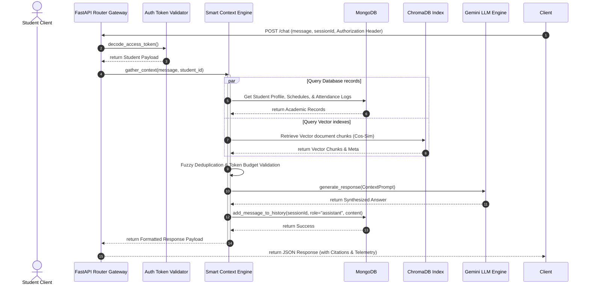

# BIT Mesra AI Campus Assistant & Student Workspace

[](#)
[](LICENSE)
[](#)
[](#)

The **BIT Mesra AI Assistant** is a production-grade digital campus assistant and personalized academic workspace built for students, administrators, and visitors of Birla Institute of Technology, Mesra.

This workspace integrates a two-stage hybrid RAG pipeline, Dijkstra-based campus maps navigation, timetable loaders, attendance calculations, check-list planners, and administrative document crawlers into a single, cohesive interface.

---

## 📖 Table of Contents
1. [Overview & Rationale](#overview--rationale)
2. [Key Features](#key-features)
3. [System Architecture](#system-architecture)
4. [Technology Stack](#technology-stack)
5. [AI & RAG Pipeline Flow](#ai--rag-pipeline-flow)
6. [Folder Directory Layout](#folder-directory-layout)
7. [Installation & Local Setup](#installation--local-setup)
8. [API & Endpoints Reference](#api--endpoints-reference)
9. [Automated QA & Stress Testing](#automated-qa--stress-testing)
10. [Production Deployment](#production-deployment)
11. [Contributing](#contributing)
12. [License](#license)
13. [Acknowledgements](#acknowledgements)

---

## 🎯 Overview & Rationale

### The Problem
University campus information is often fragmented across separate PDF bulletins, dynamic deans' portals, and department notices. Finding building locations, exam seat allocations, bus schedules, or checking bunk safety requirements usually requires checking multiple websites.

### The Solution
The **BIT Mesra AI Assistant** resolves this by consolidating campus resources into a unified portal:
- **For Students**: Combines attendance tracking, class routines, checklists, and map directions.
- **For Administrators**: Provides tools to upload PDF bulletins and crawl webpages, keeping the RAG knowledge index up to date.

---

## 🚀 Key Features

- **Academic Command Center**: Dynamic bento-grid dashboard showing schedules, attendance trackers, checklist planners, and calendar events.
- **Typography-First Assistant**: Clean, chat-like interface that prioritizes text readability, citations, and collapsed debug panels.
- **AI-Powered Timetable Imports**: Scans course sheets using Gemini Vision to automatically extract class times, locations, and teachers, writing them to MongoDB.
- **Dijkstra Campus Maps**: Calculates walking paths, ETA durations, and directions between landmarks and department buildings.
- **Incremental Website Sync**: Hourly cron checks monitor webpage changes, re-indexing vector stores when hashes change.
- **Observability Diagnostics**: Collaspible logs (`▼ Diagnostics`) display cosine similarities, Cross-Encoder ratings, latency metrics, and prompt token budgets.

---

## 🏗 System Architecture

The project employs a decoupled client-server architecture. Client requests are checked using JWT middlewares before routing to background solvers or LLM pipelines.

```mermaid
graph TB
    subgraph Client Layer (React Frontend)
        UI[React UI Dashboard]
        MapUI[Campus Navigation View]
        ChatUI[AI Assistant Interface]
    end

    subgraph API & Core Gateway (FastAPI Backend)
        Router[FastAPI Route Dispatcher]
        Middleware[Timing, ID & Security Middleware]
        Auth[JWT Token Validator]
    end

    subgraph Service Orchestration Layer
        DashboardSvc[Dashboard Service]
        ContextEngine[Smart Context Engine]
        RAGSvc[Hybrid RAG Engine]
        NavEngine[Navigation Router]
        Crawler[Website Sync Scheduler]
    end

    subgraph Persistence Layer
        Mongo[(MongoDB Database)]
        Chroma[(ChromaDB Vector Index)]
        Uploads[Static Uploads File Store]
    end

    UI & MapUI & ChatUI <-->|"HTTP REST (JWT)"| Router
    Router --> Middleware
    Middleware --> Auth
    Auth --> DashboardSvc & ContextEngine & RAGSvc & NavEngine
    
    DashboardSvc <--> Mongo
    NavEngine <--> Mongo
    Crawler <--> Mongo
    
    RAGSvc <--> Chroma
    Crawler <--> Chroma
    
    ContextEngine --> RAGSvc
    ContextEngine --> DashboardSvc
    ContextEngine --> LLM[Google Gemini 2.5 API]
    
    Router --> Uploads
```

---

## 💻 Technology Stack

| Layer | Technologies | Rationale |
| :--- | :--- | :--- |
| **Frontend** | React 18, TypeScript, TailwindCSS, React Router v6, Zustand | Lightweight component modules with fast Vite builds. |
| **Backend** | FastAPI, Python 3.13, Pydantic v2, JWT Security | Asynchronous non-blocking route execution. |
| **AI Models** | Google Gemini 2.5 Flash, BAAI/bge-small-en-v1.5, Sentence-Transformers | Fast LLM token generation, dense embeddings, and Cross-Encoder ranking. |
| **Databases** | MongoDB, ChromaDB | Document structures for student records and persistent vector spaces. |

---

## 🤖 AI & RAG Pipeline Flow

When a student queries the assistant, the prompt compiles using context-aware providers:



---

## 📂 Folder Directory Layout

```text
bit-mesra-ai-agent/
├── backend/                  # FastAPI Application
│   ├── app/
│   │   ├── auth/             # JWT signers & route authenticators
│   │   ├── context/          # Context providers (Profile, Timetable, RAG)
│   │   ├── core/             # MongoDB, ChromaDB clients and base configurations
│   │   ├── models/           # Pydantic schema validator classes
│   │   ├── routes/           # REST endpoints
│   │   ├── security/         # Security middlewares, timing, ID, & rate limiters
│   │   └── services/         # Core business logic
│   └── tests/                # Backend unit and integration tests
├── docs/                     # Design documents & API specifications
└── frontend/                 # React client Application
    ├── src/
    │   ├── app/              # Layout wrappers, theme styles & providers
    │   ├── features/         # Encapsulated component pages (chat, map, academics)
    │   └── shared/           # Common components (Sidebar, Navbar)
```

---

## ⚙ Installation & Local Setup

### Prerequisites
- **Python 3.13+**
- **Node.js 18+**
- **MongoDB** running locally or via an Atlas connection string.
- A **Google Gemini API Key**.

### Clone Repository
```bash
git clone https://github.com/Anugrahbhuinya/bit-mesra-ai-agent.git
cd bit-mesra-ai-agent
```

### Backend Setup
1. Navigate to the backend directory:
   ```bash
   cd backend
   ```
2. Create and activate a virtual environment:
   ```bash
   python -m venv venv
   # On Windows:
   venv\Scripts\activate
   # On macOS/Linux:
   source venv/bin/activate
   ```
3. Install dependencies:
   ```bash
   pip install -r requirements.txt
   ```
4. Create a `.env` file from the example:
   ```bash
   cp .env.example .env
   ```
5. Run the FastAPI local server:
   ```bash
   uvicorn app.main:app --reload --port 8001
   ```

### Frontend Setup
1. Navigate to the frontend directory:
   ```bash
   cd ../frontend
   ```
2. Install npm packages:
   ```bash
   npm install
   ```
3. Run the Vite development server:
   ```bash
   npm run dev
   ```

---

## 🌐 API & Endpoints Reference

Refer to the complete API specifications in the [REST API Reference Guide](docs/API.md).

| Route | Method | Purpose | Authentication |
| :--- | :--- | :--- | :--- |
| `/api/auth/register` | `POST` | Registers a new student account | No |
| `/api/auth/login` | `POST` | Validates credentials and returns JWT token | No |
| `/chat` | `POST` | Processes chat queries using hybrid context-aware RAG | Optional |
| `/api/academics/dashboard` | `GET` | Fetches consolidated timetable/attendance details | Yes |
| `/api/admin/documents/upload` | `POST` | Uploads and indexes PDF documents | Yes (Admin) |
| `/api/admin/websites` | `POST` | Crawls and indexes a webpage URL | Yes (Admin) |

---

## 🧪 Automated QA & Stress Testing

The platform contains a dedicated quality assurance suite to verify unit isolated code logic, endpoint integration, and security controls:
- **Run the full test suite**:
  ```bash
  cd backend
  python -m pytest
  ```
- **Measure execution latency and throughput**:
  ```bash
  python tests/performance_runner.py
  ```
- **Refer to documentation**:
  - [QA & Testing Reference Guide](docs/Testing.md)
  - [High-Level Design Document](docs/HLD.md)
  - [Low-Level Design Document](docs/LLD.md)

---

## 🚢 Production Deployment

Refer to the complete instructions in the [Production Deployment Guide](docs/Deployment.md) for configurations using Docker Compose, Nginx reverse proxy blocks, and Let's Encrypt TLS setups.

---

## 🤝 Contributing

Contributions are welcome! Please review our [Contributing Guidelines](CONTRIBUTING.md) to understand branch conventions, semantic commit formats, and review cycles.

---

## 📄 License

This project is licensed under the MIT License - see the [LICENSE](LICENSE) file for details.

---

## 💖 Acknowledgements

Special thanks to Birla Institute of Technology, Mesra, and the creators of the libraries and models that power this campus agent.
