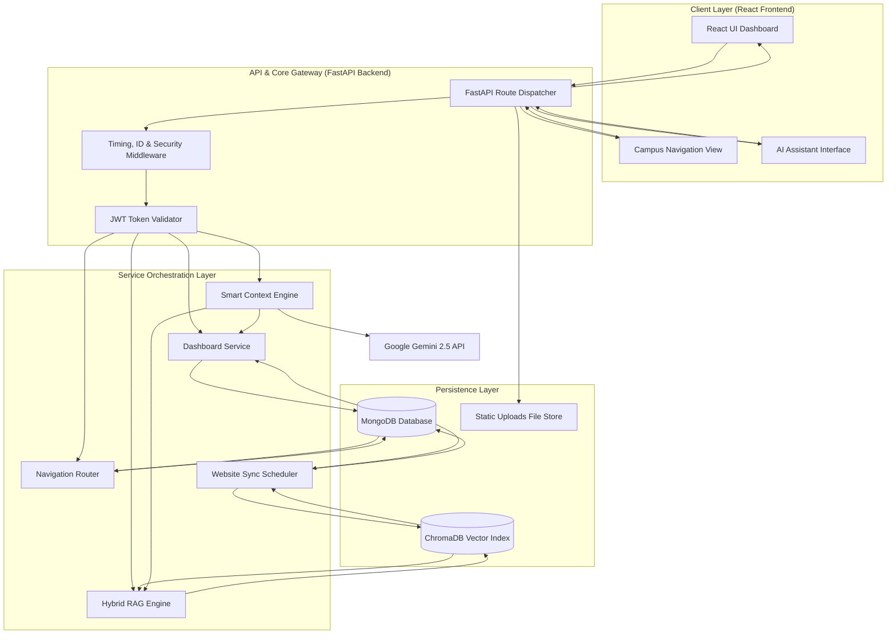

# High-Level Design (HLD)

This document describes the high-level design, software boundaries, component architectures, and system properties of the **BITAtlas Workspace**.

---

## 1. System Overview

The **BITAtlas Workspace** is an AI-powered digital campus assistant and academic dashboard. It provides:
1. **Student Command Center**: Dynamic schedules, attendance analytics, checklists, and calendar timelines.
2. **AI Campus Assistant**: Citation-grounded answers based on hybrid RAG, campus maps navigation, and academic profile state.
3. **Knowledge Ingestion Portal**: Document and website crawlers with synchronization check schedules for administrator use.

---

## 2. High-Level Architecture Diagram

The system employs a client-server separation model. Communication is structured around REST API exchanges, using JWT bearer claims for authorization.

---

## 3. Major Components

### 3.1 Frontend Architecture
- **Tech Stack**: React 18, TypeScript, TailwindCSS, React Router v6.
- **Organization**: Encapsulated by domain capabilities (`src/features/` folders):
  - `academics`: Coordinates timetables, attendance registers, checklists, and timelines.
  - `chat`: Controls RAG conversation streams, microphone inputs, speaker outputs, and diagnostic traces.
  - `map`: Renders path coordinates overlay and landmarks directory.
  - `auth`: Manages session registration, login, and localStorage JWT properties.

### 3.2 Backend Architecture
- **Tech Stack**: FastAPI, Python 3.13, Pydantic v2, Motor (Async MongoDB Driver).
- **SoC (Separation of Concerns)**: Separates controller endpoints (`routes/`) from business logics (`services/`), database configurations (`core/`), and query layers (`repositories/`).
- **Startup Lifecycle**: Manages index seeding, pre-loads the Cross-Encoder re-ranker model, and starts scheduler threads.

### 3.3 Authentication & Authorization
- **Protocol**: JWT-based session security.
- **Rules**: Student endpoints require standard user claims. PDF uploads, website Crawlers, crawler histories, settings, and bulk sync controls are restricted to administrators.

### 3.4 AI Pipeline
- **Smart Context Engine**: Concurrently queries dynamic providers (Student profile, Timetable schedules, Attendance logs, Checklists, and ChromaDB vector documents) using `asyncio.gather`.
- **Deduplication & Budgeting**: Deduplicates matching documents (Jaccard > 0.85) and trims prompts to fit within the 3,500 token limit.
- **LLM**: Invokes Gemini 2.5 Flash to synthesize citation-linked natural language answers.

### 3.5 Ingestion & Synchronization
- **PDF Ingestion**: Extracts text using PyPDF, recursive-splits text into 500-character segments, embeds them via HuggingFace's `BAAI/bge-small-en-v1.5`, and writes to ChromaDB.
- **Website Ingestion & Sync**: Normalizes webpage contents (strips date tags, counters, dynamic IDs) and schedules hourly cron update loops to re-index pages when hashes change.

### 3.6 Navigation Pipeline
- **Graph Database**: Campus intersections, landmarks, and gates are modeled as graph nodes and edges stored in MongoDB.
- **Solver**: Computes routes, distance metrics, and walking instructions using Dijkstra's algorithm.

---

## 4. Database Architecture

The persistence tier relies on a polyglot storage design:
1. **MongoDB**: Serves as the transactional database (stores schedules, attendance, planners, crawler audit logs, and user credentials).
2. **ChromaDB**: Serves as the semantic index (stores 384-dimensional document and webpage chunk embeddings).
3. **Local File Store**: Houses raw PDF manuals and uploaded user profiles.

---

## 5. Technology Choices & Rationale

- **FastAPI**: Selected for native asynchronous execution loops and automatic OpenAPI schema compilers.
- **ChromaDB**: Chosen as a lightweight, developer-friendly vector database ideal for localized campus retrievals.
- **MongoDB**: Asynchronous schema-less design allows rapid modification of nested objects (such as class timetables or planner items) without complex migration scripts.
- **Gemini 2.5 Flash**: Chosen for its fast inference, native JSON streaming, and wide context window support.

---

## 6. System Considerations

### 6.1 Security Considerations
- **JWT Signature Verification**: Standard signature checks are executed on all protected endpoints.
- **Path Traversal Protection**: Upload endpoints sanitize filenames using `secure_filename` utilities to prevent directory traversal.
- **Prompt Injection Blocks**: Query validation layers screen user inputs for prompt override patterns before RAG assembly.

### 6.2 Performance Optimizations
- **Model Preloading**: HuggingFace Embedder and Cross-Encoder models are preloaded on server start to avoid latency penalties on initial requests.
- **Deduplication**: Eliminating near-duplicate RAG chunks saves up to 40% in token overhead and avoids model confusion.
- **Async Concurrency**: Database calls and network crawlers are run asynchronously, preventing CPU thread blocks.
