# BIT Mesra AI Workspace — Documentation Index

Welcome to the official documentation directory for the **BIT Mesra AI Workspace**. This directory contains comprehensive design specifications, system flow descriptions, API references, security standards, and deployment guides.

---

## 🗺 Documentation Map

```mermaid
graph TD
    Home[Documentation Home] --> Design[System Design]
    Home --> Tech[Technical References]
    Home --> Ops[Operations & Testing]

    subgraph System Design
        Design --> HLD[docs/HLD.md - High-Level Design]
        Design --> LLD[docs/LLD.md - Low-Level Design]
        Design --> Architecture[docs/Architecture.md - Flows & Sequence Diagrams]
    end

    subgraph Technical References
        Tech --> API[docs/API.md - REST API Reference]
        Tech --> Database[docs/Database.md - Database Schema]
        Tech --> RAG[docs/RAG.md - RAG & AI Pipeline]
        Tech --> ADR[docs/ADR.md - Architecture Decision Records]
    end

    subgraph Operations & Testing
        Ops --> Deployment[docs/Deployment.md - Docker & Production Setup]
        Ops --> Security[docs/Security.md - Security & Middlewares]
        Ops --> Testing[docs/Testing.md - QA & Test Guides]
        Ops --> Performance[docs/Performance.md - Benchmarks & Latency]
        Ops --> Troubleshooting[docs/Troubleshooting.md - Operational Guides]
    end

    style Home fill:#2563eb,stroke:#1d4ed8,color:#ffffff
    style Design fill:#10b981,stroke:#047857,color:#ffffff
    style Tech fill:#f59e0b,stroke:#b45309,color:#ffffff
    style Ops fill:#8b5cf6,stroke:#6d28d9,color:#ffffff
```

---

## 📂 Document Index

### 1. System Design & HLD/LLD
- **[High-Level Design (docs/HLD.md)](HLD.md)**: High-level component overview, user boundaries, and system architectures.
- **[Low-Level Design (docs/LLD.md)](LLD.md)**: File-level boundaries, React rendering trees, and backend FastAPI logic layers.
- **[Detailed System Flows (docs/Architecture.md)](Architecture.md)**: Sequence diagrams representing parallel context gathering, Dijkstra navigation route solvers, and incremental BeautifulSoup crawling updates.

### 2. Core Technical References
- **[REST API Reference (docs/API.md)](API.md)**: Fully detailed endpoint pathways, parameter validators, request/response models, and status codes.
- **[Database Schema Design (docs/Database.md)](Database.md)**: Database index collections, MongoDB schemas, and Chroma vector store metadata configurations.
- **[RAG & AI Pipeline (docs/RAG.md)](RAG.md)**: Cosine similarity retrievals, Cross-Encoder reranking models, context merge deduplication, and prompt budgeting controls.
- **[Architecture Decision Records (docs/ADR.md)](ADR.md)**: Explains the engineering rationale behind our framework choices (FastAPI, React+Vite, MongoDB, ChromaDB, and Gemini 2.5 Flash).

### 3. Operations, Deployment & Security
- **[Production Deployment Guide (docs/Deployment.md)](Deployment.md)**: Multi-container Docker Compose files, Nginx reverse proxy blocks, Let's Encrypt TLS setups, and production recommendations.
- **[Security Architecture (docs/Security.md)](Security.md)**: JWT signatures, bcrypt hashing work factors, input validations, file uploads path sanitization, and prompt injection mitigation patterns.
- **[QA & Testing Guide (docs/Testing.md)](Testing.md)**: Pytest instructions, testing hierarchies, and manual checklist validation gates.
- **[Performance & Latency (docs/Performance.md)](Performance.md)**: Throughput latency limits, re-ranker preloading speeds, and pipeline load baselines.
- **[Troubleshooting & Recovery (docs/Troubleshooting.md)](Troubleshooting.md)**: Error resolving guides, database index repair pipelines, and service recovery runs.
