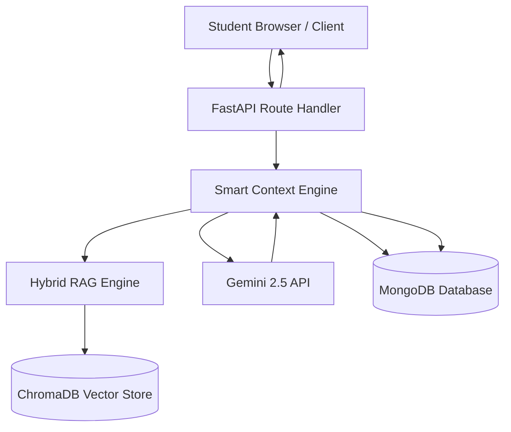
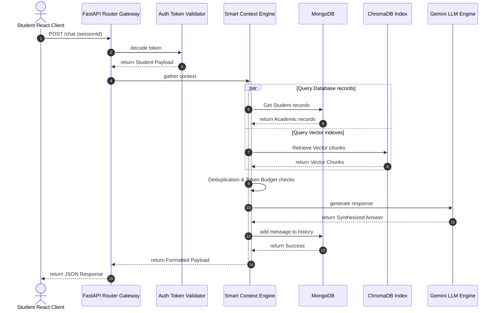
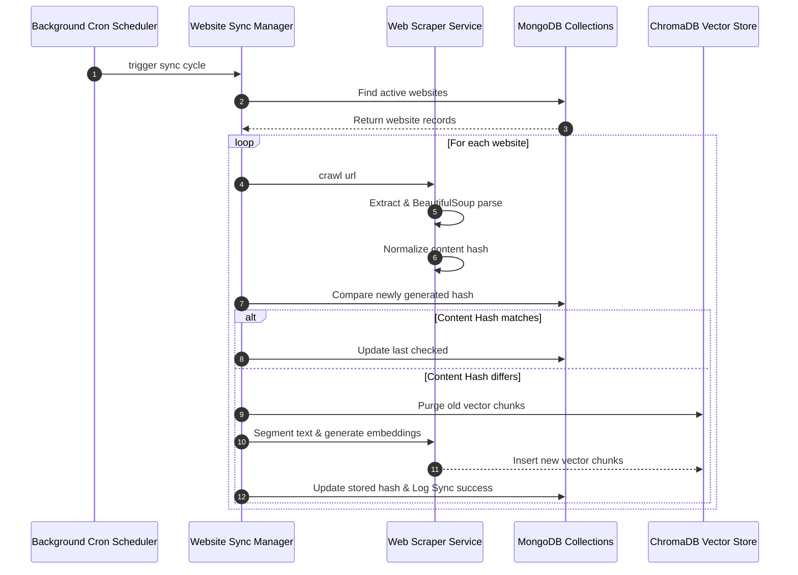

# System Architecture & Request Flows

This document details the detailed system flow diagrams, request lifecycles, and sequence diagrams of the **BITAtlas Workspace**.

---

## 1. Overall System Dataflow

The platform processes student actions through dedicated routing pipelines, loading credentials and compiling relevant contexts before invoking target engines.

---

## 2. Request Lifecycle Flows

### 2.1 Chat Request Flow (Smart Context Pipeline)
When a query is dispatched to the `/chat` route:
1. **Request Received**: The router gateway intercepts the HTTP POST request.
2. **Session Verification**: The system decodes the JWT signature to resolve the active student's session profile.
3. **Intent Detection**: The keyword classifier matches the query terms to determine if the query represents an academic question, navigation check, or general FAQ lookup.
4. **Parallel Gathering**: `ContextOrchestrator` calls active providers concurrently using `asyncio.gather`:
   - `ProfileProvider` queries MongoDB for registration credentials.
   - `TimetableProvider` fetches course times.
   - `RAGProvider` embeds the query and fetches semantic chunks from ChromaDB.
5. **Deduplication**: `FuzzyDeduplicator` matches text segments (Jaccard > 0.85) to purge redundant pages.
6. **Token Compression & Budgeting**: If token limits are exceeded (max `3,500`), the budget manager trims lower-priority chunks.
7. **Synthesis**: The prompt builder packages the structured prompt and sends it to Gemini 2.5 Flash.
8. **Logging & Return**: The generated response is saved to the MongoDB thread history, and returned to the frontend.

---

## 3. Sequence Interaction Diagrams

### 3.1 End-to-End Chat Query Sequence

### 3.2 Website Crawling & Automatic Synchronization Sequence

